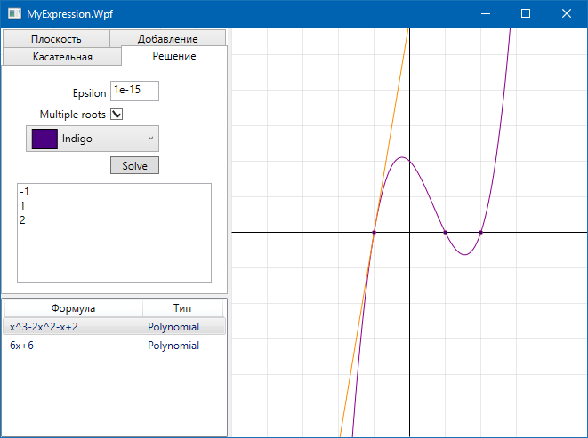

# MyExpression
|Branch|Build|
|:----:|:---:|
| `latest` | [](https://ci.appveyor.com/project/prekel/myexpression) |
| `master` | [](https://ci.appveyor.com/project/prekel/myexpression/branch/master) |
| `develop` | [](https://ci.appveyor.com/project/prekel/myexpression/branch/develop) |

## Решение алгебраических уравнений любой степени с заданной точностью
```c#
var s = "x^3-2x^2-x+2";
var eps = 1e-8;
var p = Polynomial.Parse(s);
var e = new PolynomialEquation(p, eps);
e.Solve();
Assert.AreEqual(-1, e.Roots[0], 1e-7);
Assert.AreEqual(0, p.Calculate(e.Roots[0]), 1e-7);
Assert.AreEqual(1, e.Roots[1], 1e-7);
Assert.AreEqual(0, p.Calculate(e.Roots[1]), 1e-7);
Assert.AreEqual(2, e.Roots[2], 1e-7);
Assert.AreEqual(0, p.Calculate(e.Roots[2]), 1e-7);
```

## Создание функции из строки
```c#
var s = "sin(x)";
var c = new CodeDomEval(s);
Func<double, double> f = c.Calculate;
Assert.AreEqual(0, f(0), 1e-7);
Assert.AreEqual(1, f(Math.PI / 2), 1e-7);
Assert.AreEqual(0, f(Math.PI), 1e-7);
Assert.AreEqual(Math.Sqrt(2) / 2, f(Math.PI / 4), 1e-7);
```

## Графический интерфейс для этого и постройка графиков

